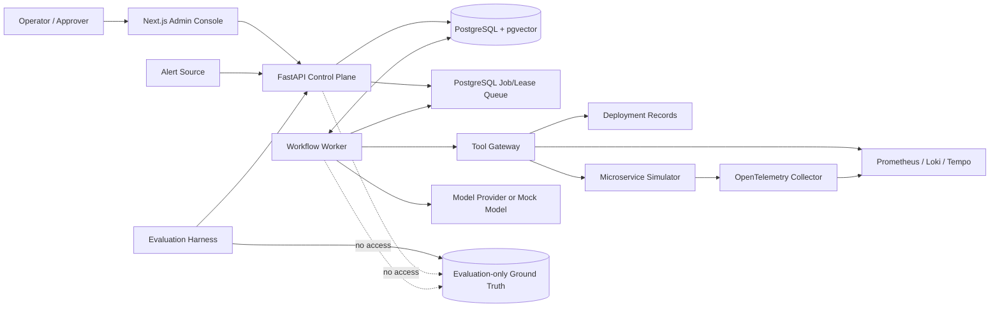
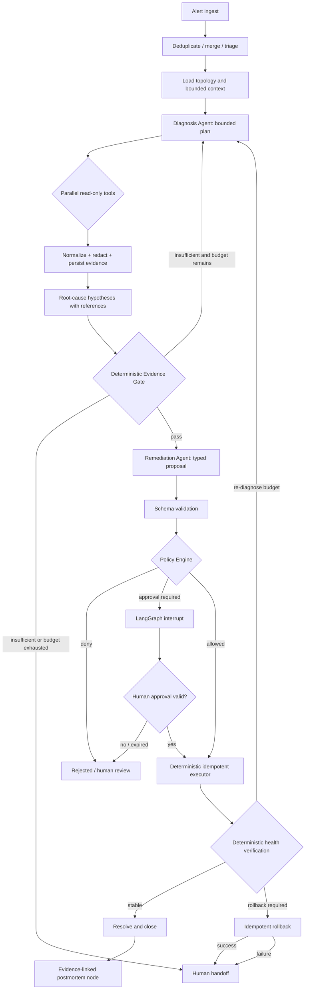

# AgentOps Architecture

## System context



## Container/module boundaries

| Boundary | Responsibility | Must not do |
| --- | --- | --- |
| API | authentication, RBAC, incident/approval/query APIs, request validation, job creation | execute recovery inline or own workflow loops |
| Worker | claim leased work, run LangGraph workflows, persist checkpoints | bypass gateway/policy/approval |
| Domain | incident states, evidence/policy/action contracts and invariants | depend on FastAPI, ORM, or model SDKs |
| Evidence | normalize, redact, hash, persist, expire, resolve artifacts | infer root cause |
| Tool Gateway | validate versioned calls, enforce permission/risk/timeout/retry/idempotency, audit | expose arbitrary shell/network capabilities |
| Policy/Approval | deterministic risk decisions and proposal-bound approvals | trust client-side checks |
| Executor | allowlisted idempotent mutation with locks and snapshots | accept free-form commands |
| Verifier/Rollback | determine observed recovery and safe rollback route | accept LLM declaration of success |
| Evaluation | datasets, Ground Truth, baselines, scoring, reports | leak labels to runtime/model context |
| Console | explain state/evidence and collect authorized intent | become system of record |

## Workflow graph



## LangGraph state and durability

The graph state is a versioned Pydantic model holding identifiers and bounded summaries, not large raw telemetry. Raw results live behind Artifact references. Key fields include workflow/incident IDs, state schema version, plan and attempt budgets, selected tool calls, evidence IDs, hypotheses, gate decision, remediation proposal fingerprint, policy decision, approval reference, action reference, verification observations, rollback reference, and error classification.

Each externally visible transition writes domain state, outbox/audit event, and next job intent transactionally where possible. PostgreSQL checkpointing supports pauses, interrupts, cancellation, and worker recovery. Jobs use `SELECT ... FOR UPDATE SKIP LOCKED` (or an equivalently documented strategy), owner/lease timestamps, heartbeat, attempts, and stale-lease reclamation. Execution idempotency is independent of workflow retry semantics.

LangGraph, rather than a black-box general ReAct agent, is the workflow authority because the graph must expose safety routing, durable pauses, resumption, and compensation. `langchain-core` model/message/tool-schema or retriever components may be used underneath nodes where helpful, but Evidence, Policy, RBAC, Executor, and Verifier remain application/domain responsibilities.

## Investigation parallelism and bounded loops

The Diagnosis Agent may propose only tools from the supplied catalog and within maximum step, parallelism, wall-clock, and token budgets. Tool arguments pass schemas before dispatch. Independent read-only calls can fan out; results join at evidence normalization. A deterministic router decides whether missing evidence justifies replanning. Replanning has a hard attempt limit and repeated-equivalent-query detection.

## Data and trust flow

```text
telemetry/deployments (untrusted)
  -> tool adapter -> raw Artifact (immutable/hash)
  -> parser/redactor/injection classifier
  -> normalized Evidence (provenance + quality)
  -> budgeted Context Builder output
  -> agent hypothesis (references only)
  -> Evidence Gate resolves references against store
```

Historical incidents use a separate trust label. Similarity search results include source incident, age, outcome status, and Artifact links; they can suggest a query but cannot satisfy evidence requirements for the current incident.

## Control plane safety sequence

Approval binds `(incident_id, proposal_hash, policy_decision_id, actor, expiry)`. Immediately before execution, the server re-loads all records, verifies RBAC, state, hashes, expiry, policy version, and idempotency key, then acquires a target/action lock. Any material proposal edit creates a new version and invalidates the old approval. Append-only events capture request and result hashes plus before/after state.

## API outline

The initial API surface will be versioned under `/api/v1` and cover authentication principal resolution, incidents, timelines, investigation control, evidence/artifacts, hypotheses, approvals, actions, verification, audit, prompts, tools, and evaluations. Commands use idempotency keys and optimistic concurrency/version fields. Read APIs paginate and enforce incident-level authorization.

## Deployment topology

The reference Compose topology separates `api`, `worker`, `console`, control-plane `postgres`, observability backends, OTel Collector, and simulator services. The simulator includes its own PostgreSQL and Redis as diagnosed dependencies. Redis is not a control-plane queue or cache in the MVP. The runtime and Ground Truth evaluator use different Compose profiles/networks/credentials so runtime containers cannot read evaluation labels.

## Dependency direction

```text
adapters (FastAPI, SQLAlchemy, LangGraph, providers, telemetry)
    -> application use cases
        -> domain contracts and invariants
```

Infrastructure implements domain ports. Domain code does not import web, ORM, graph, or vendor SDKs. This keeps policy, evidence gates, state transitions, and idempotency directly unit-testable.

## Planned package shape

```text
apps/api/                 FastAPI composition and routes
apps/worker/              job leasing and workflow runner
agentops/domain/          pure domain models and invariants
agentops/application/     use cases and ports
agentops/workflows/       LangGraph state/nodes/routes
agentops/infrastructure/  SQLAlchemy, tools, model and telemetry adapters
console/                  Next.js UI
simulator/                services, scenarios and fault controls
evaluation/               datasets, isolated Ground Truth and scoring
tests/                    unit, contract, integration, workflow and E2E
```

The exact layout is accepted only when the first code-scaffolding TODO is implemented and may change through an ADR.
